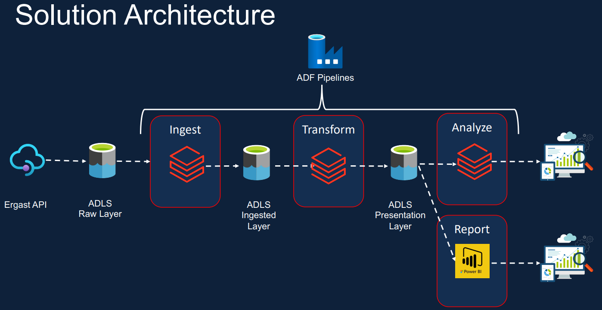

# 🏎️ Formula 1 Azure Databricks Data Engineering Project

This project demonstrates a complete **end-to-end cloud data engineering solution** using **Azure Databricks**, **Delta Lake**, and **Azure Data Factory (ADF)**, based on real-world Formula 1 racing data using the Ergast API.

The goal is to ingest, transform, and analyze structured and semi-structured data to generate insights like driver standings, constructor rankings, and race outcomes that is aligned with modern **lakehouse architecture** and **data engineering best practices**.

---

## 🚀 Technologies Used

- **Azure Databricks** – Notebooks, Spark SQL, PySpark
- **Delta Lake** – ACID-compliant data versioning
- **Azure Data Factory** – Pipeline orchestration
- **Azure Data Lake Storage Gen2 (ADLS)** – Cloud storage
- **Unity Catalog** – Governance and lineage
- **Power BI** – Visual reporting

---

## 📊 Solution Overview

### 1. **Ingestion**
- Ingested raw CSV/JSON files from ADLS
- Used Databricks notebooks with schema enforcement
- Applied data validation and ingestion metadata

### 2. **Transformation**
- Cleaned and normalized circuits, drivers, races, and results data
- Joined multiple datasets using PySpark
- Derived new columns (e.g., ingestion date, file date)

### 3. **Storage**
- Stored processed data as Delta tables
- Applied partitioning by `race_year`
- Implemented Lakehouse layers (Bronze → Silver → Gold)

### 4. **Pipeline Orchestration (ADF)**
- Modular ADF pipelines for ingestion and transformation
- Conditional logic using `If Condition` and `Get Metadata`
- Master pipeline to coordinate full flow
- Monitored via ADF triggers and execution logs

---

## 🧱 Project Structure

- set-up - Notebooks used to set up and configure how Databricks access Azure Data Lake Gen2 storage.
- dataset - Contains datasets used
- bronze - Contains dataset ingestion into data lake
- ingestion - Notebooks used to ingest data on Databricks
- transformed - Notebooks used to transform data on Databricks
- analysis - Data Visualization using SQL
- utils - SQL Incremental load preparation
- includes - Some common configurations that we can use from others notebooks
- demo - Some tasks used to validate all project

---

## ✅ Key Learning Outcomes

- Implemented a Lakehouse architecture using **Delta Lake**
- Worked with PySpark, schema enforcement, partitioning
- Designed modular, robust pipelines in **ADF**
- Managed metadata, triggers, and notebook workflows

---

## 📸 Solution architecture & Master Pipeline 

  
   
  <em>Azure Databricks solution architecture</em>

  
   
  <em>Master ADF pipeline orchestrating ingestion and transformation</em>

---

## 📘 Documentation

[Project Walkthrough (PDF)](./Azure_databricks_data_engineering_project.pdf)

---

## 👨🏽‍💻 Author

**Sithsaba Zantsi**  
_Cloud & Data Engineer_  
📫 [Connect on LinkedIn](https://www.linkedin.com/in/sithsaba-zantsi/)

---

## 📜 License

This project is for educational purposes and does not hold any proprietary data or licensing constraints.

